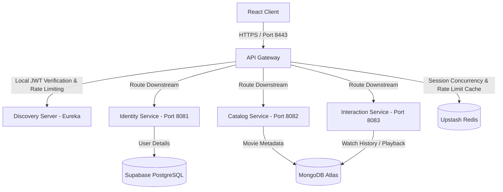

# ASP.NET Core & Spring Boot Interview Prep Guide: Streamix Architecture

Preparing for a C# / ASP.NET Core role when your main project is in Java/Spring Boot is highly feasible. Conceptually, **Spring Boot and ASP.NET Core are sister frameworks**. They both implement standard Enterprise Web patterns: Dependency Injection, MVC Controllers, Middleware/Filters, ORM/Database mapping, and Configuration management.

This guide maps your **Streamix** streaming platform project directly to .NET concepts so you can discuss it fluently and live-code similar patterns on demand.

---

## 🗺️ Framework Mapping: Java vs. C# (.NET)

| Concept | Java (Spring Boot) | C# (ASP.NET Core) | Notes / Details |
| :--- | :--- | :--- | :--- |
| **Language** | Java 21 | C# (12 / .NET 8 or 9) | C# is very similar to Java but has features like Properties (`get; set;`), Async/Await natively, and Linq. |
| **Dependency Injection** | `@Component`, `@Service`, `@Autowired` | Constructor injection, `IServiceCollection` registration | ASP.NET Core has built-in DI. Registration is done in `Program.cs`. |
| **Controller Mapping** | `@RestController`, `@RequestMapping("/api")` | `[ApiController]`, `[Route("api")]` | ASP.NET Core uses Attributes instead of Annotations. |
| **Http Actions** | `@GetMapping`, `@PostMapping` | `[HttpGet]`, `[HttpPost]` | Map HTTP requests to action methods. |
| **Request Binding** | `@RequestBody`, `@PathVariable`, `@RequestParam` | `[FromBody]`, `[FromRoute]`, `[FromQuery]` | Tells the model binder where to extract incoming parameters. |
| **Model Validation** | `jakarta.validation` (`@Valid`, `@NotNull`) | `System.ComponentModel.DataAnnotations` | Data annotations (`[Required]`, `[EmailAddress]`) on DTOs. |
| **Database Access** | Spring Data JPA / Hibernate | Entity Framework Core (EF Core) | JPA uses repositories extending interface interfaces. EF Core uses a `DbContext` and DB Sets. |
| **NoSQL Database** | Spring Data MongoDB (`MongoTemplate`) | Official MongoDB C# Driver (`IMongoCollection`) | Both represent documents as strong C# or Java classes. |
| **Security Pipeline** | Spring Security, Filters (`OncePerRequestFilter`) | Authentication & Authorization Middleware | .NET uses a middleware pipeline to validate JWTs. |
| **API Gateway** | Spring Cloud Gateway | YARP (Yet Another Reverse Proxy) or Ocelot | Standard reverse proxy packages in .NET. |
| **Caching/Redis** | Upstash Redis (`StringRedisTemplate`) | StackExchange.Redis / `IDistributedCache` | Libraries to interface with Redis cache store. |

---

## 🏗️ Streamix System Architecture: How to Explain It

When the interviewer asks: **"Tell me about a recent project you built,"** present Streamix as a production-like microservice application. 



### Key Technical Talking Points for the Interview:
1. **Clean Microservice Decoupling**: 
   - **Identity Service**: Dedicated to Auth. Uses SQL (**Supabase PostgreSQL**) for strict relational storage (users, reset tokens).
   - **Catalog Service**: Handles TMDB API ingestion and stores movie metadata in **MongoDB** because TMDB metadata is nested and document-like.
   - **Interaction Service**: Tracks user watchlists and active video watch history, stored in **MongoDB** for rapid writes and schema flexibility.
2. **Edge-Level Gateway Pattern**:
   - The Gateway (Spring Cloud Gateway) serves as the single entry point. It handles CORS globally, enforces security headers, and applies rate limiting via Redis.
   - **Performance Optimization**: The Gateway performs **local JWT verification** (using the shared JWT secret signature check) and injects the extracted user identity as an `X-User-Email` header. Downstream services trust this header, preventing them from making duplicate database or remote calls to verify tokens.
3. **Distributed Caching & Security**:
   - **Rate Limiting**: Implemented at the gateway level using a token-bucket algorithm via **Upstash Redis** to protect endpoints from DDoS or brute-force registration attempts.
   - **Session Concurrency**: Uses Redis to limit concurrent sessions to a maximum of 5 devices per account.
4. **Third-Party Security (Frontend)**:
   - Ingests streaming links from external video delivery providers. To secure the React client, you implemented **HTML5 Iframe Sandboxing** (`sandbox="allow-scripts allow-same-origin"`) to block malicious advertisements, automatic redirects, and popups.

---

## 💻 Code Comparison: Spring Boot vs. ASP.NET Core

If asked to code a controller or database model on the spot, write with confidence using these side-by-side patterns:

### 1. The Controller Pattern
This comparison shows how to build a classic REST API endpoint that receives a POST request, validates input, handles dependencies, and returns structured responses.

````carousel
```java
// === SPRING BOOT (Java) ===
@RestController
@RequestMapping("/auth")
public class AuthController {
    
    private final AuthService authService;

    // Constructor Dependency Injection
    public AuthController(AuthService authService) {
        this.authService = authService;
    }

    @PostMapping("/register")
    public ResponseEntity<?> register(@Valid @RequestBody RegisterRequest request) {
        try {
            String userId = authService.saveUser(request);
            return ResponseEntity.status(HttpStatus.CREATED).body(userId);
        } catch (Exception e) {
            return ResponseEntity.status(HttpStatus.BAD_REQUEST).body(e.getMessage());
        }
    }
}
```
<!-- slide -->
```csharp
// === ASP.NET CORE (C#) ===
using Microsoft.AspNetCore.Mvc;

[ApiController]
[Route("auth")]
public class AuthController : ControllerBase
{
    private readonly IAuthService _authService;

    // Constructor Dependency Injection (Native)
    public AuthController(IAuthService authService)
    {
        _authService = authService;
    }

    [HttpPost("register")]
    public async Task<IActionResult> Register([FromBody] RegisterRequest request)
    {
        try
        {
            // Note: ASP.NET Core validates Model attributes automatically.
            // If invalid, it returns 400 Bad Request before hitting the method.
            string userId = await _authService.SaveUserAsync(request);
            return StatusCode(StatusCodes.Status21Created, userId);
        }
        catch (Exception ex)
        {
            return BadRequest(ex.Message);
        }
    }
}
```
````

---

### 2. Request Data Binding & Validation
How DTOs are mapped and validated. Note that C# utilizes properties with automated getters/setters.

````carousel
```java
// === SPRING BOOT (Java) ===
import jakarta.validation.constraints.Email;
import jakarta.validation.constraints.NotBlank;
import jakarta.validation.constraints.Size;

public class RegisterRequest {
    @NotBlank(message = "Email is required")
    @Email(message = "Invalid email format")
    private String email;

    @NotBlank(message = "Password is required")
    @Size(min = 6, message = "Password must be at least 6 chars")
    private String password;

    // Getters and Setters (or Lombok @Data / @Getter / @Setter)
    public String getEmail() { return email; }
    public void setEmail(String email) { this.email = email; }
    public String getPassword() { return password; }
    public void setPassword(String password) { this.password = password; }
}
```
<!-- slide -->
```csharp
// === ASP.NET CORE (C#) ===
using System.ComponentModel.DataAnnotations;

public class RegisterRequest
{
    [Required(ErrorMessage = "Email is required")]
    [EmailAddress(ErrorMessage = "Invalid email format")]
    public string Email { get; set; } = string.Empty;

    [Required(ErrorMessage = "Password is required")]
    [MinLength(6, ErrorMessage = "Password must be at least 6 chars")]
    public string Password { get; set; } = string.Empty;
}
```
````

---

### 3. Database Access (ORM)
How database tables map to entities and repositories. C# uses Entity Framework Core (EF Core) with `DbContext`, which acts as a unit of work and repository wrapper.

````carousel
```java
// === SPRING BOOT (Java JPA) ===
@Entity
@Table(name = "user_credentials")
public class UserCredential {
    @Id
    @GeneratedValue(strategy = GenerationType.IDENTITY)
    private Integer id;

    @Column(unique = true, nullable = false)
    private String email;

    private String password;
}

// Repository Interface (JPA automatically generates query implementations)
@Repository
public interface UserRepository extends JpaRepository<UserCredential, Integer> {
    Optional<UserCredential> findByEmail(String email);
}
```
<!-- slide -->
```csharp
// === ASP.NET CORE (EF Core) ===
using System.ComponentModel.DataAnnotations;
using System.ComponentModel.DataAnnotations.Schema;
using Microsoft.EntityFrameworkCore;

[Table("user_credentials")]
public class UserCredential
{
    [Key]
    [DatabaseGenerated(DatabaseGeneratedOption.Identity)]
    public int Id { get; set; }

    [Required]
    public string Email { get; set; } = string.Empty;

    public string Password { get; set; } = string.Empty;
}

// Database Context (Acts as JPA EntityManager + Repository layer)
public class ApplicationDbContext : DbContext
{
    public ApplicationDbContext(DbContextOptions<ApplicationDbContext> options) 
        : base(options) { }

    public DbSet<UserCredential> Users { get; set; }
}

// Service implementation accessing DB
public class UserService 
{
    private readonly ApplicationDbContext _context;
    public UserService(ApplicationDbContext context) => _context = context;

    public async Task<UserCredential?> GetUserByEmailAsync(string email)
    {
        return await _context.Users.FirstOrDefaultAsync(u => u.Email == email);
    }
}
```
````

---

### 4. Custom Middleware (Pipeline Interceptors)
If asked to build a custom interceptor (like logging request parameters, measuring execution time, or checking custom headers):

````carousel
```java
// === SPRING BOOT (OncePerRequestFilter) ===
@Component
public class RequestTimerFilter extends OncePerRequestFilter {
    @Override
    protected void doFilterInternal(HttpServletRequest request, 
                                    HttpServletResponse response, 
                                    FilterChain filterChain) 
                                    throws ServletException, IOException {
        long startTime = System.currentTimeMillis();
        try {
            filterChain.doFilter(request, response);
        } finally {
            long duration = System.currentTimeMillis() - startTime;
            System.out.println("Request to " + request.getRequestURI() + " took " + duration + " ms");
        }
    }
}
```
<!-- slide -->
```csharp
// === ASP.NET CORE (Middleware) ===
public class RequestTimerMiddleware
{
    private readonly RequestDelegate _next;

    public RequestTimerMiddleware(RequestDelegate next)
    {
        _next = next;
    }

    public async Task InvokeAsync(HttpContext context)
    {
        var stopwatch = System.Diagnostics.Stopwatch.StartNew();
        try
        {
            // Execute the next middleware in the pipeline
            await _next(context);
        }
        finally
        {
            stopwatch.Stop();
            var duration = stopwatch.ElapsedMilliseconds;
            Console.WriteLine($"Request to {context.Request.Path} took {duration} ms");
        }
    }
}

// In Program.cs:
// app.UseMiddleware<RequestTimerMiddleware>();
```
````

---

## 🙋 Common Interview Questions (C# & ASP.NET Core)

Be ready to answer these classic .NET-specific questions with these succinct explanations:

### Q1. What are the lifetimes of Dependency Injection in ASP.NET Core?
*   **Transient**: Services are created *every time they are requested*. Best for lightweight, stateless services.
*   **Scoped**: Services are created *once per request (HTTP request)*. Best for services that hold state within a request, like Entity Framework `DbContext`.
*   **Singleton**: Services are created *once and shared across the entire lifetime of the application*. Best for caching services, application state, or thread-safe shared configurations.
> *Spring equivalent:* Singleton is Spring's default scope. Scoped maps to `@RequestScope`, and Transient maps to `@Scope("prototype")`.

### Q2. How does EF Core query execution work? (Deferred vs. Immediate execution)
*   **Deferred Execution (IQueryable)**: LINQ queries written against a database context are not executed immediately. Instead, they compile into an expression tree. Execution only happens when the data is materialized (e.g., calling `.ToListAsync()`, `.FirstOrDefaultAsync()`, or looping over it via `foreach`).
*   **AsNoTracking()**: By default, EF Core tracks changes to entities returned by queries. If you only want to read data (like a movie catalog), calling `.AsNoTracking()` disables entity tracking, which drastically reduces memory usage and speeds up query execution.

### Q3. Explain the ASP.NET Core Middleware Pipeline.
*   The middleware pipeline is a sequence of delegates called in order to process incoming HTTP requests and outgoing responses.
*   Each middleware component chooses whether to pass the request to the next delegate (`await _next(context)`) or short-circuit it (e.g., returning 401 Unauthorized directly).
*   *Common pipeline middleware order*: `UseRouting()` -> `UseCors()` -> `UseAuthentication()` -> `UseAuthorization()` -> Map endpoints.

### Q4. How do you implement asynchronous execution in .NET?
*   Uses the **TAP (Task-based Asynchronous Pattern)** with `async` and `await` keywords.
*   Methods returning `Task` or `Task<T>` represent ongoing work. Using `await` yields the thread back to the thread pool while the I/O operation (like a DB query or TMDB API call) completes, allowing the server to handle higher concurrent traffic.
*   *Warning*: Avoid calling `.Result` or `.Wait()` on tasks, as it block the thread and can lead to thread pool starvation or deadlocks.

---

## 🚀 Recommended Plan to Solidify this Knowledge
1. **Explore the codebase**: Click the links below to see how they are structured in Java so you have the logic fresh in your head:
   - [AuthController.java](file:///c:/Users/Aman/Desktop/Streamix/backend/identity-service/src/main/java/com/streamix/identity_service/controller/AuthController.java) (Authentication & Password resetting)
   - [AuthenticationFilter.java](file:///c:/Users/Aman/Desktop/Streamix/backend/api-gateway/src/main/java/com/streamix/api_gateway/filter/AuthenticationFilter.java) (Gateway filter for local JWT validation)
   - [InteractionController.java](file:///c:/Users/Aman/Desktop/Streamix/backend/interaction-service/src/main/java/com/streamix/interaction/controller/InteractionController.java) (MongoDB updates and watchlist updates)
   - [MovieService.java](file:///c:/Users/Aman/Desktop/Streamix/backend/catalog-service/src/main/java/com/streamix/catalog/service/MovieService.java) (TMDB Ingestion and caching patterns)
2. **Review your concepts**: Tell me what specific concepts you want to walk through next. We can:
   - Convert specific parts of your Spring Boot logic into complete C# / ASP.NET classes.
   - Practice mock coding questions.
   - Deep dive into database indexing, thread management, or security details.
